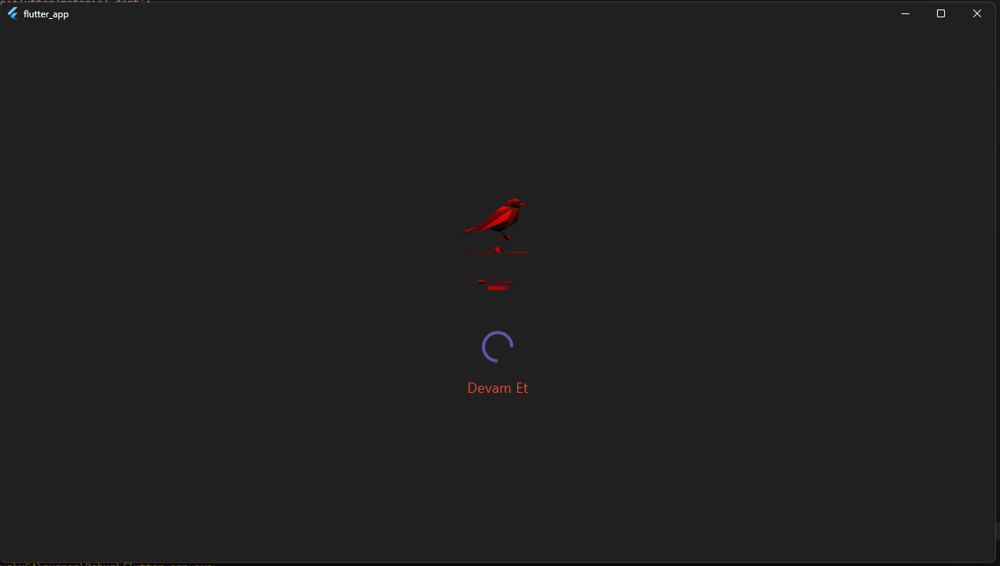
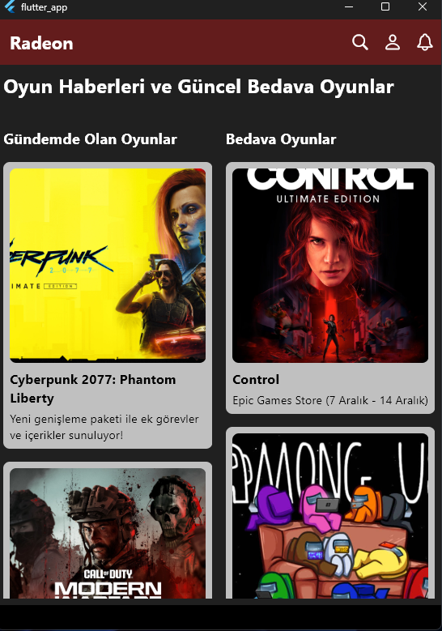
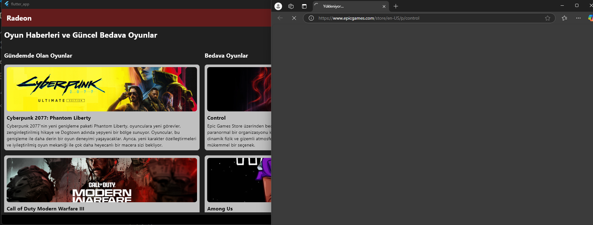

# flutter_app

A new Flutter project.

# Flutter Projesi

  


  

## Proje Hakkında

projenin asıl amacı oyun dünyasındaki haberleri kullanıcıya göstermek 

  

## Ekibimiz

-  **Danışman:**  
[https://github.com/keyvanarasteh](Keyvan Arasteh)


-  **Takım Üyeleri:**

- ahmet emre kara [https://github.com/endikol88]

  

## Özellikler

- [haberlere hızlı erişim]

- [ileri zamanlarda bir blok uygulaması]


  

## Kullanılan Teknolojiler

- Flutter

- Dart

- [Diğer teknolojiler]

  

## Başlangıç

  

### Gereksinimler

- Flutter SDK (sürüm X.X.X)

- Dart SDK (sürüm X.X.X)

- [Diğer gerekli yazılımlar]

  

### Kurulum Adımları

1. Projeyi bilgisayarınıza indirin:

```bash

git  clone [proje-adresi]

```

  

2. Proje klasörüne gidin:

```bash

cd [proje-adı]

```

  

3. Gerekli paketleri yükleyin:

```bash

flutter  pub  get

```

  

4. Uygulamayı başlatın:

```bash

flutter  run

```

  

## Proje Yapısı

```

lib/

├── modeller/ # Veri modelleri

├── ekranlar/ # Uygulama ekranları

├── widgets/ # Tekrar kullanılabilir arayüz öğeleri

├── servisler/ # API servisleri

└── yardımcılar/ # Yardımcı fonksiyonlar

```
## Demo 
nms-web


  

## Ekran Görüntüleri



 görsele basıldığı zaman linke gitme

## Projeye Katkı Sağlama

1. Projeyi forklayın

2. Yeni bir dal oluşturun (`git checkout -b ozellik/YeniOzellik`)

3. Değişikliklerinizi kaydedin (`git commit -m 'Yeni özellik eklendi'`)

4. Dalınıza gönderin (`git push origin ozellik/YeniOzellik`)

5. Pull Request oluşturun

  

## Lisans

[Lisans türü] kapsamında lisanslanmıştır. Daha fazla bilgi için `LICENSE` dosyasını inceleyebilirsiniz.

  

## İletişim

- Proje Bağlantısı: [https://github.com/endikol88/Q-Flutter.git]

- İstinye Üniversitesi: [https://www.istinye.edu.tr/](https://www.istinye.edu.tr/)

  

## Teşekkürler

- İstinye Üniversitesi'ne destekleri için teşekkür ederiz
